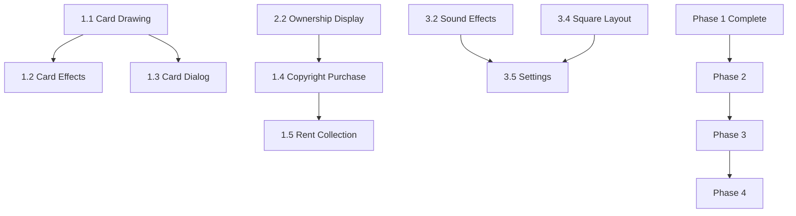

# Literature Board Game - Development Roadmap

## Executive Summary

This roadmap outlines the prioritized development plan for completing the Flutter Literature Board Game MVP. The game is currently ~70% complete with core mechanics implemented (dice rolling, movement, turn switching, question answering). The remaining work focuses on completing strategic gameplay elements (card system, copyright purchase, rent collection), UI improvements, and polish features.

---

## Phase 1: Core Gameplay Completion (MVP Foundation)

**Priority:** CRITICAL - Must complete first for playable game
**Goal:** Enable full game loop with strategic elements

### 1.1 Card Drawing Logic
**Complexity:** Medium
**Dependencies:** None (card data exists in [`lib/providers/card_provider.dart`](../lib/providers/card_provider.dart))

**Description:** Implement the logic to draw cards when players land on Chance (ŞANS) or Fate (KADER) tiles.

**Tasks:**
- Add card drawing method to [`GameNotifier`](../lib/providers/game_provider.dart:151) in [`lib/providers/game_provider.dart`](../lib/providers/game_provider.dart)
- Implement random card selection from appropriate deck (sansCards or kaderCards)
- Add state tracking for drawn card
- Trigger card dialog display

**Files to Modify:**
- [`lib/providers/game_provider.dart`](../lib/providers/game_provider.dart) - Add `drawCard()` method
- [`lib/models/card.dart`](../lib/models/card.dart) - May need minor updates

---

### 1.2 Card Effect Application
**Complexity:** High
**Dependencies:** 1.1 Card Drawing Logic

**Description:** Implement all card effects defined in [`CardEffect`](../lib/models/card.dart:6) enum.

**Tasks:**
- Implement personal effects (gainStars, loseStars, skipNextTax, freeTurn, easyQuestionNext)
- Implement global effects (allPlayersGainStars, allPlayersLoseStars, taxWaiver, allPlayersEasyQuestion)
- Implement targeted effects (publisherOwnersLose, richPlayerPays)
- Add effect logging to game log
- Handle bankruptcy from card effects

**Files to Modify:**
- [`lib/providers/game_provider.dart`](../lib/providers/game_provider.dart) - Add `applyCardEffect()` method
- [`lib/models/player.dart`](../lib/models/player.dart) - Add flags for tax waiver, easy question
- [`lib/models/card.dart`](../lib/models/card.dart) - Verify effect definitions

---

### 1.3 Card Dialog Integration
**Complexity:** Low
**Dependencies:** 1.1 Card Drawing Logic

**Description:** Re-enable and integrate the card dialog widget.

**Tasks:**
- Uncomment [`CardDialog`](../lib/widgets/card_dialog.dart:6) in [`lib/widgets/card_dialog.dart`](../lib/widgets/card_dialog.dart)
- Add dialog trigger in [`GameView`](../lib/views/game_view.dart:10)
- Connect dialog dismissal to effect application
- Test card display for both ŞANS and KADER types

**Files to Modify:**
- [`lib/widgets/card_dialog.dart`](../lib/widgets/card_dialog.dart) - Uncomment code
- [`lib/views/game_view.dart`](../lib/views/game_view.dart) - Add dialog overlay
- [`lib/providers/game_provider.dart`](../lib/providers/game_provider.dart) - Add card state

---

### 1.4 Copyright Purchase Flow
**Complexity:** Medium
**Dependencies:** None (dialog exists in [`lib/widgets/copyright_purchase_dialog.dart`](../lib/widgets/copyright_purchase_dialog.dart))

**Description:** Implement the complete copyright purchase system for book/publisher tiles.

**Tasks:**
- Add purchase decision handling in [`GameNotifier`](../lib/providers/game_provider.dart:151)
- Implement ownership tracking in [`Player`](../lib/models/player.dart:1) model
- Deduct stars on purchase
- Add tile to player's ownedTiles list
- Prevent purchase if insufficient funds
- Log purchase transactions

**Files to Modify:**
- [`lib/providers/game_provider.dart`](../lib/providers/game_provider.dart) - Add `purchaseCopyright()` method
- [`lib/models/player.dart`](../lib/models/player.dart) - Verify ownedTiles handling
- [`lib/models/tile.dart`](../lib/models/tile.dart) - Add owner tracking
- [`lib/views/game_view.dart`](../lib/views/game_view.dart) - Add purchase dialog trigger

---

### 1.5 Rent/Copyright Collection
**Complexity:** High
**Dependencies:** 1.4 Copyright Purchase Flow

**Description:** Implement rent payment when players land on owned tiles.

**Tasks:**
- Check tile ownership on landing
- Calculate rent amount (based on tile.copyrightFee)
- Transfer stars from current player to tile owner
- Handle bankruptcy from rent payment
- Log rent transactions
- Handle special cases (owner in Library Watch, etc.)

**Files to Modify:**
- [`lib/providers/game_provider.dart`](../lib/providers/game_provider.dart) - Add `collectRent()` method
- [`lib/models/tile.dart`](../lib/models/tile.dart) - Add owner field
- [`lib/models/player.dart`](../lib/models/player.dart) - Verify star transfer logic

---

### 1.6 Question Timer Countdown
**Complexity:** Low
**Dependencies:** None (timer UI exists in [`QuestionDialog`](../lib/widgets/question_dialog.dart:5))

**Description:** Implement actual countdown timer for question answering.

**Tasks:**
- Add timer state management in [`GameNotifier`](../lib/providers/game_provider.dart:151)
- Implement countdown logic using Timer or Stream
- Update timer display in [`QuestionDialog`](../lib/widgets/question_dialog.dart:5)
- Auto-fail question when timer reaches zero
- Add visual warning when time is low (<10 seconds)

**Files to Modify:**
- [`lib/providers/game_provider.dart`](../lib/providers/game_provider.dart) - Add timer logic
- [`lib/widgets/question_dialog.dart`](../lib/widgets/question_dialog.dart) - Connect timer
- [`lib/constants/game_constants.dart`](../lib/constants/game_constants.dart) - Verify timer duration

---

## Phase 2: UI Improvements & Visual Feedback

**Priority:** HIGH - Enhances gameplay experience
**Goal:** Improve player understanding and game state visibility

### 2.1 Game Log UI
**Complexity:** Low
**Dependencies:** None (log data exists in state)

**Description:** Re-enable and integrate the game log widget.

**Tasks:**
- Uncomment [`GameLogWidget`](../lib/widgets/game_log.dart:7) in [`lib/widgets/game_log.dart`](../lib/widgets/game_log.dart)
- Add log widget to [`GameView`](../lib/views/game_view.dart:10) layout
- Style log for readability
- Implement auto-scroll to latest messages
- Add message filtering (optional)

**Files to Modify:**
- [`lib/widgets/game_log.dart`](../lib/widgets/game_log.dart) - Uncomment code
- [`lib/views/game_view.dart`](../lib/views/game_view.dart) - Add widget to layout

---

### 2.2 Tile Ownership Display
**Complexity:** Medium
**Dependencies:** 1.4 Copyright Purchase Flow

**Description:** Visual indication of tile ownership on the board.

**Tasks:**
- Add owner color indicator to [`EnhancedTileWidget`](../lib/widgets/enhanced_tile_widget.dart)
- Display owner name or initials on owned tiles
- Add border or background color change for owned tiles
- Show multiple owners if needed (unlikely in this game)
- Update display when ownership changes

**Files to Modify:**
- [`lib/widgets/enhanced_tile_widget.dart`](../lib/widgets/enhanced_tile_widget.dart) - Add owner display
- [`lib/models/tile.dart`](../lib/models/tile.dart) - Ensure owner field accessible
- [`lib/providers/tile_provider.dart`](../lib/providers/tile_provider.dart) - May need updates

---

### 2.3 Player Bankruptcy Visuals
**Complexity:** Low
**Dependencies:** None (bankruptcy logic exists)

**Description:** Visual feedback when a player goes bankrupt.

**Tasks:**
- Add grayscale or dimmed effect to bankrupt player cards
- Display "İFLAS OLDU" badge on player info
- Remove bankrupt player from turn indicators
- Add animation for bankruptcy event
- Update player list display

**Files to Modify:**
- [`lib/views/game_view.dart`](../lib/views/game_view.dart) - Update player card styling
- [`lib/widgets/enhanced_player_info_panel.dart`](../lib/widgets/enhanced_player_info_panel.dart) - Add bankruptcy visual

---

### 2.4 Enhanced Turn Phase Indicators
**Complexity:** Low
**Dependencies:** None (turn phase state exists)

**Description:** Clear visual indication of current turn phase.

**Tasks:**
- Add phase indicator to UI (waitingRoll, rolling, moving, resolvingTile, answering, turnEnd)
- Use icons or text to show current phase
- Highlight relevant UI elements based on phase
- Add phase transition animations

**Files to Modify:**
- [`lib/views/game_view.dart`](../lib/views/game_view.dart) - Add phase indicator
- [`lib/widgets/enhanced_dice_widget.dart`](../lib/widgets/enhanced_dice_widget.dart) - Phase-aware styling

---

## Phase 3: Polish & Enhancements

**Priority:** MEDIUM - Improves quality of life
**Goal:** Complete feature set and user experience

### 3.1 Restart Game Functionality
**Complexity:** Low
**Dependencies:** None

**Description:** Allow players to restart the game after completion.

**Tasks:**
- Add restart button to game over screen
- Reset all game state (players, tiles, logs, etc.)
- Reinitialize game with same players
- Confirm restart action with dialog
- Clear all temporary state

**Files to Modify:**
- [`lib/providers/game_provider.dart`](../lib/providers/game_provider.dart) - Add `restartGame()` method
- [`lib/views/game_view.dart`](../lib/views/game_view.dart) - Add restart button
- [`lib/main.dart`](../lib/main.dart) - May need initialization updates

---

### 3.2 Sound Effects
**Complexity:** Medium
**Dependencies:** None

**Description:** Add audio feedback for game events.

**Tasks:**
- Add audio package to [`pubspec.yaml`](../pubspec.yaml)
- Prepare sound files (dice roll, movement, correct answer, wrong answer, card draw, bankruptcy, win)
- Implement sound manager class
- Trigger sounds on appropriate events
- Add sound toggle option in settings

**Files to Modify:**
- [`pubspec.yaml`](../pubspec.yaml) - Add audio dependencies
- `lib/services/sound_manager.dart` - Create new file
- [`lib/providers/game_provider.dart`](../lib/providers/game_provider.dart) - Trigger sounds
- [`lib/views/game_view.dart`](../lib/views/game_view.dart) - Add settings UI

---

### 3.3 Save/Load Game
**Complexity:** High
**Dependencies:** None

**Description:** Persist game state for later continuation.

**Tasks:**
- Add shared_preferences or hive package to [`pubspec.yaml`](../pubspec.yaml)
- Implement serialization for all game models
- Create save game method
- Create load game method
- Add save/load buttons to UI
- Handle save file management
- Validate loaded game state

**Files to Modify:**
- [`pubspec.yaml`](../pubspec.yaml) - Add persistence dependencies
- `lib/services/save_manager.dart` - Create new file
- [`lib/models/player.dart`](../lib/models/player.dart) - Add toJson/fromJson
- [`lib/models/tile.dart`](../lib/models/tile.dart) - Add toJson/fromJson
- [`lib/models/question.dart`](../lib/models/question.dart) - Add toJson/fromJson
- [`lib/models/card.dart`](../lib/models/card.dart) - Add toJson/fromJson
- [`lib/providers/game_provider.dart`](../lib/providers/game_provider.dart) - Add save/load methods
- [`lib/views/game_view.dart`](../lib/views/game_view.dart) - Add save/load UI

---

### 3.4 Square Board Layout
**Complexity:** Medium
**Dependencies:** None (layout exists but disabled)

**Description:** Enable alternative square board layout option.

**Tasks:**
- Re-enable square board view in [`BoardView`](../lib/views/board_view.dart)
- Add layout toggle button
- Ensure player tokens display correctly on square layout
- Test responsiveness on different screen sizes
- Add layout preference to settings

**Files to Modify:**
- [`lib/views/board_view.dart`](../lib/views/board_view.dart) - Re-enable square layout
- [`lib/views/game_view.dart`](../lib/views/game_view.dart) - Add layout toggle
- [`lib/widgets/board_widget.dart`](../lib/widgets/board_widget.dart) - Update for square layout

---

### 3.5 Settings Screen
**Complexity:** Low
**Dependencies:** 3.2 Sound Effects, 3.4 Square Board Layout

**Description:** Centralized settings for game preferences.

**Tasks:**
- Create settings screen widget
- Add sound toggle
- Add layout preference (horizontal/square)
- Add question timer duration option
- Add animation speed option
- Persist settings using shared_preferences

**Files to Modify:**
- `lib/views/settings_view.dart` - Create new file
- [`lib/main.dart`](../lib/main.dart) - Add settings route
- [`lib/views/game_view.dart`](../lib/views/game_view.dart) - Add settings button

---

### 3.6 Enhanced Animations
**Complexity:** Medium
**Dependencies:** None

**Description:** Improve visual polish with additional animations.

**Tasks:**
- Add card draw animation
- Add copyright purchase animation
- Add rent payment animation (stars flying between players)
- Add bankruptcy animation
- Add winner celebration animation
- Improve dice roll animation

**Files to Modify:**
- [`lib/widgets/enhanced_tile_widget.dart`](../lib/widgets/enhanced_tile_widget.dart) - Add animations
- [`lib/widgets/enhanced_dice_widget.dart`](../lib/widgets/enhanced_dice_widget.dart) - Improve animation
- [`lib/views/game_view.dart`](../lib/views/game_view.dart) - Add animation overlays

---

## Phase 4: Testing & Bug Fixes

**Priority:** HIGH - Ensure quality
**Goal:** Stable, bug-free experience

### 4.1 Unit Tests
**Complexity:** Medium
**Dependencies:** All previous phases

**Description:** Add comprehensive unit tests for game logic.

**Tasks:**
- Test dice rolling logic
- Test player movement
- Test turn switching
- Test card effects
- Test copyright purchase
- Test rent collection
- Test bankruptcy detection

**Files to Modify:**
- `test/game_engine_test.dart` - Create new file
- `test/game_provider_test.dart` - Create new file
- `test/player_test.dart` - Create new file

---

### 4.2 Widget Tests
**Complexity:** Medium
**Dependencies:** All previous phases

**Description:** Add widget tests for UI components.

**Tasks:**
- Test tile widgets
- Test player info panels
- Test dialogs (question, card, purchase)
- Test dice widget
- Test game log

**Files to Modify:**
- `test/widget_test.dart` - Expand existing file
- `test/tile_widget_test.dart` - Create new file
- `test/dialog_test.dart` - Create new file

---

### 4.3 Integration Tests
**Complexity:** High
**Dependencies:** All previous phases

**Description:** End-to-end testing of complete game flow.

**Tasks:**
- Test complete game from start to finish
- Test multiplayer scenarios
- Test edge cases (bankruptcy, all tiles owned)
- Test save/load functionality
- Test settings persistence

**Files to Modify:**
- `integration_test/app_test.dart` - Expand existing file

---

### 4.4 Bug Fixes & Refinement
**Complexity:** Variable
**Dependencies:** All previous phases

**Description:** Address issues found during testing.

**Tasks:**
- Fix reported bugs
- Optimize performance
- Improve error handling
- Refactor code for maintainability
- Update documentation

**Files to Modify:**
- Variable based on issues found

---

## Rationale for Ordering

### Phase 1 First (Critical Path)
The features in Phase 1 are essential for a playable game. Without card drawing, copyright purchase, and rent collection, the game lacks strategic depth and the core Monopoly-like mechanics. These features form the foundation of gameplay and must be completed before any polish work.

### Phase 2 Second (User Experience)
Once the game is playable, Phase 2 focuses on making the game state visible and understandable. The game log, ownership display, and bankruptcy visuals help players understand what's happening and make informed decisions. These improvements significantly enhance the gameplay experience without requiring new mechanics.

### Phase 3 Third (Quality of Life)
Phase 3 features are nice-to-have but not essential for basic gameplay. Restart, sound effects, and save/load improve the overall experience but don't affect core gameplay. These can be implemented incrementally after the game is fully functional.

### Phase 4 Last (Quality Assurance)
Testing and bug fixes should happen throughout development, but a dedicated testing phase ensures all features work together correctly. This phase validates the entire system and catches integration issues that might be missed during feature development.

---

## Dependency Graph

---

## Implementation Notes

### Key Considerations

1. **State Management:** The game uses Riverpod for state management. All new features should follow the existing pattern of immutable state updates via [`GameNotifier`](../lib/providers/game_provider.dart:151).

2. **Immutability:** The [`Player`](../lib/models/player.dart:1) and [`GameState`](../lib/providers/game_provider.dart:29) models use immutable patterns. Always use `copyWith()` for updates.

3. **Logging:** All game events should be logged using the `withLogMessage()` method in [`GameState`](../lib/providers/game_provider.dart:138).

4. **Bankruptcy:** Always check for bankruptcy after any star deduction using `_checkBankruptcy()`.

5. **Turn Phases:** The turn phase state machine ([`TurnPhase`](../lib/providers/game_provider.dart:10)) controls what actions are available. Ensure proper phase transitions.

### File Organization

- **Models:** [`lib/models/`](../lib/models/) - Data structures
- **Providers:** [`lib/providers/`](../lib/providers/) - State management
- **Widgets:** [`lib/widgets/`](../lib/widgets/) - Reusable UI components
- **Views:** [`lib/views/`](../lib/views/) - Screen-level widgets
- **Constants:** [`lib/constants/`](../lib/constants/) - Configuration values
- **Engine:** [`lib/engine/`](../lib/engine/) - Game logic (legacy, may be deprecated)

### Testing Strategy

1. Write unit tests for pure functions (dice roll, position calculation)
2. Write widget tests for UI components
3. Write integration tests for complete game flows
4. Test edge cases (bankruptcy, all tiles owned, etc.)

---

## Success Criteria

### Phase 1 Complete
- Players can draw and use ŞANS and KADER cards
- Players can purchase copyrights on book/publisher tiles
- Players pay rent when landing on owned tiles
- Question timer counts down and auto-fails on timeout

### Phase 2 Complete
- Game log displays all game events
- Tile ownership is clearly visible on the board
- Bankrupt players are visually distinguished
- Current turn phase is clearly indicated

### Phase 3 Complete
- Game can be restarted after completion
- Sound effects play on key events
- Game state can be saved and loaded
- Square board layout is available
- Settings screen allows customization

### Phase 4 Complete
- All unit tests pass
- All widget tests pass
- All integration tests pass
- No critical bugs remain
- Code is well-documented

---

## Next Steps

1. Begin with **Phase 1.1: Card Drawing Logic** as it has no dependencies
2. Complete Phase 1 tasks in order to establish playable MVP
3. Move to Phase 2 for UI improvements
4. Implement Phase 3 features incrementally
5. Conduct thorough testing in Phase 4
6. Prepare for release

---

*Last Updated: 2025-12-27*
*Project: Literature Board Game*
*Framework: Flutter*
*State Management: Riverpod*
