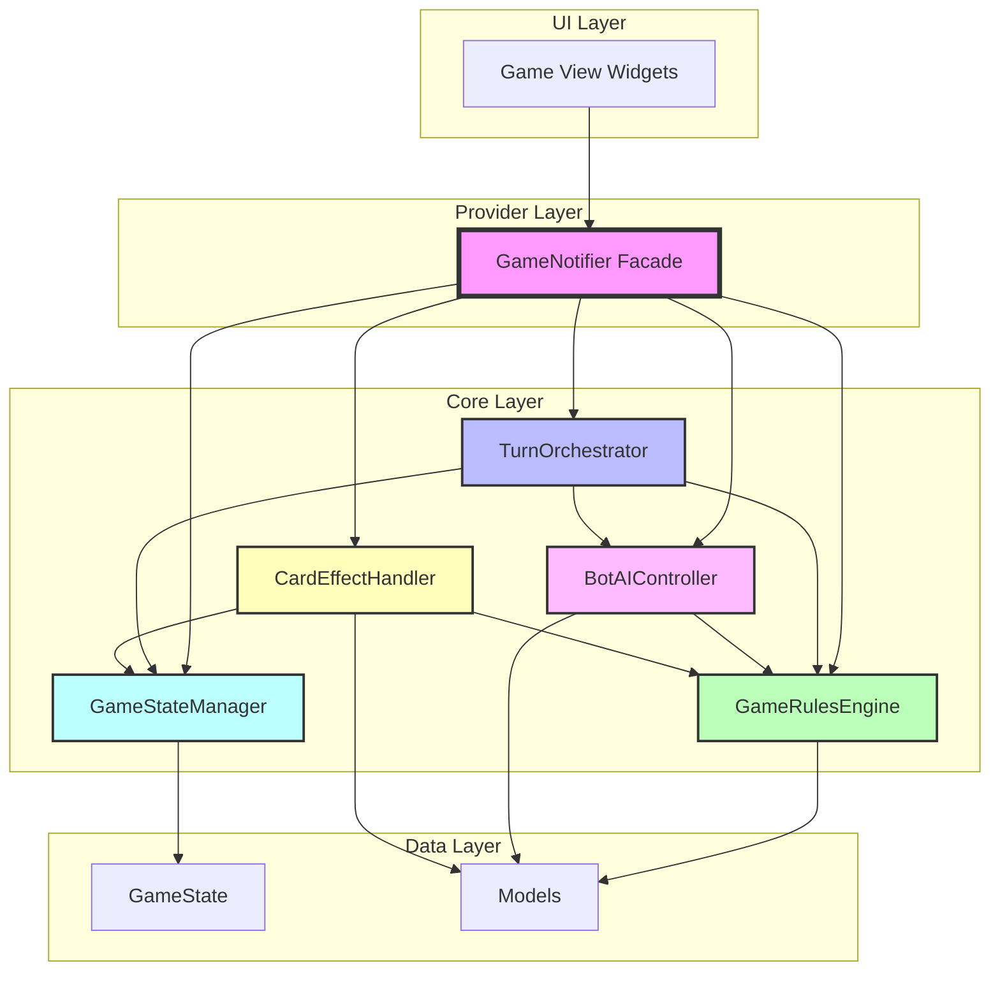
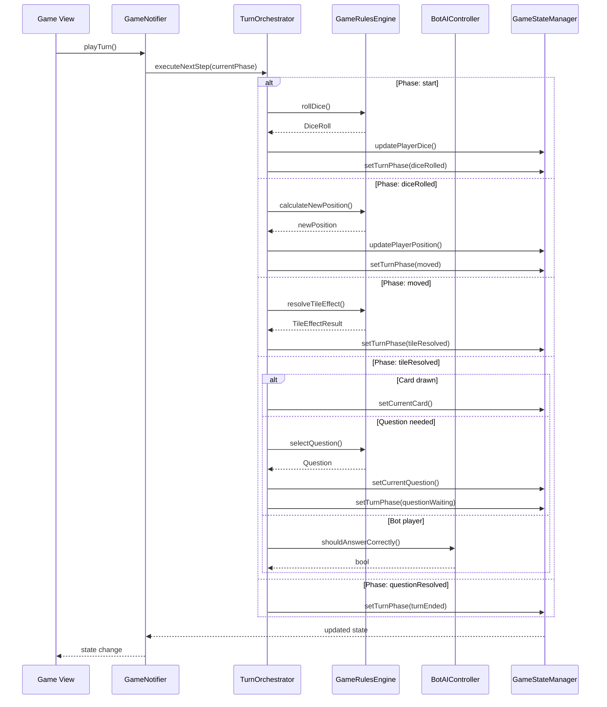
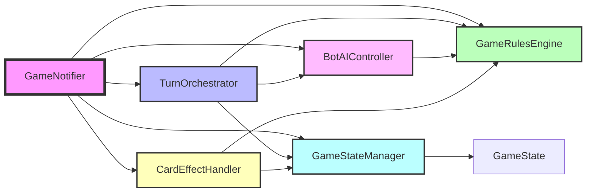

# GameNotifier Refactoring Plan

## Executive Summary

The [`GameNotifier`](../lib/providers/game_provider.dart:203) class is a monolithic "God Class" with 1,879 lines that handles too many responsibilities. This document outlines a comprehensive refactoring plan to split it into smaller, focused, single-responsibility classes following SOLID principles.

## Current State Analysis

### Class Overview
- **File**: [`lib/providers/game_provider.dart`](../lib/providers/game_provider.dart:1)
- **Lines of Code**: 1,879
- **Methods**: ~40 public/private methods
- **Responsibilities**: 10+ distinct concerns

### Identified Responsibilities

| # | Responsibility | Methods | Lines |
|---|----------------|---------|-------|
| 1 | Turn Orchestration | `playTurn()`, `_handleTileResolved()`, `getAutoAdvanceDirective()` | ~100 |
| 2 | Dice & Movement | `rollDice()`, `moveCurrentPlayer()`, `_calculateNewPosition()`, `_passedStart()`, `_handleTripleDouble()` | ~150 |
| 3 | Tile Resolution | `resolveCurrentTile()`, `_handleCornerTile()`, `_handleTaxTile()`, `_calculateTax()` | ~120 |
| 4 | Question Management | `_showQuestion()`, `_botAnswerQuestion()`, `_getRandomQuestion()`, `_getEasyQuestion()`, `answerQuestionCorrect()`, `answerQuestionWrong()`, `skipQuestion()`, `tickQuestionTimer()` | ~180 |
| 5 | Card Management | `drawCard()`, `applyCardEffect()`, `_applyGainStars()`, `_applyLoseStars()`, `_applySkipNextTax()`, `_applyFreeTurn()`, `_applyEasyQuestionNext()`, `_applyAllPlayersGainStars()`, `_applyAllPlayersLoseStars()`, `_applyTaxWaiver()`, `_applyAllPlayersEasyQuestion()`, `_applyPublisherOwnersLose()`, `_applyRichPlayerPays()` | ~250 |
| 6 | Copyright/Rent | `completeCopyrightPurchase()`, `declineCopyrightPurchase()`, `_handleBotCopyrightDecision()`, `payRent()` | ~150 |
| 7 | Turn Management | `endTurn()`, `startNextTurn()`, `_nextPlayer()` | ~120 |
| 8 | Bankruptcy & Game End | `_checkBankruptcy()`, `_checkAllPlayersBankruptcy()`, `_isGameOver()`, `_announceWinner()` | ~80 |
| 9 | State Management | `initializeGame()`, `resetGame()`, `_updatePlayerInList()`, `_updateTileInList()` | ~100 |
| 10 | Logging | `_logEvent()` | ~20 |

### Problems Identified

1. **Single Responsibility Violation**: Class handles game rules, AI, UI orchestration, state management, logging, and turn history
2. **High Coupling**: All functionality is tightly coupled within one class
3. **Low Cohesion**: Unrelated methods grouped together
4. **Difficult Testing**: Hard to test individual concerns in isolation
5. **Maintenance Burden**: Changes to one area risk breaking others
6. **Code Reusability**: Logic cannot be reused outside the provider context

---

## Proposed Architecture

### New Class Structure

```
┌─────────────────────────────────────────────────────────────────┐
│                     GameNotifier (Facade)                        │
│  - Coordinates between components                                │
│  - Maintains backward compatibility with providers                │
│  - Delegates to specialized classes                               │
└─────────────────────────────────────────────────────────────────┘
                              │
        ┌─────────────────────┼─────────────────────┐
        │                     │                     │
        ▼                     ▼                     ▼
┌───────────────┐   ┌───────────────┐   ┌───────────────┐
│ TurnOrchestrator│  │ GameRulesEngine│  │ BotAIController│
│ - Phase mgmt   │   │ - Movement    │   │ - Decisions   │
│ - Flow control │   │ - Tile effects│   │ - Strategy    │
└───────────────┘   └───────────────┘   └───────────────┘
        │                     │                     │
        └─────────────────────┼─────────────────────┘
                              │
                              ▼
                    ┌───────────────────┐
                    │ GameStateManager  │
                    │ - State mutations │
                    │ - Updates         │
                    └───────────────────┘
```

### Class Definitions

#### 1. GameNotifier (Facade Pattern)
**Purpose**: Main coordinator that maintains backward compatibility with existing providers

**Responsibilities**:
- Coordinate between specialized components
- Maintain StateNotifier interface for Riverpod
- Delegate method calls to appropriate components
- Manage component lifecycle

**Public Interface** (maintains existing API):
```dart
class GameNotifier extends StateNotifier<GameState> {
  // Existing public methods (delegated)
  void initializeGame({...});
  void playTurn();
  void rollDice();
  void moveCurrentPlayer(int diceTotal);
  void resolveCurrentTile();
  void answerQuestionCorrect();
  void answerQuestionWrong();
  void skipQuestion();
  void applyCardEffect(Card card);
  void completeCopyrightPurchase();
  void declineCopyrightPurchase();
  void endTurn();
  void startNextTurn();
  void resetGame();
  void tickQuestionTimer();
  String? getAutoAdvanceDirective();
}
```

#### 2. TurnOrchestrator
**Purpose**: Manage turn phase transitions and flow control

**File**: `lib/core/turn_orchestrator.dart`

**Responsibilities**:
- Phase state machine management
- Turn flow coordination
- Auto-advance logic
- Phase guard enforcement

**Public Interface**:
```dart
class TurnOrchestrator {
  TurnOrchestrator({
    required GameStateManager stateManager,
    required GameRulesEngine rulesEngine,
    required BotAIController botAI,
  });

  // Phase management
  void advancePhase(TurnPhase currentPhase);
  bool canAdvanceTo(TurnPhase from, TurnPhase to);
  
  // Turn flow
  void executeNextStep(TurnPhase currentPhase);
  String? getAutoAdvanceDirective(TurnPhase phase, PlayerType playerType);
  
  // Phase guards
  bool requirePhase(TurnPhase expected, TurnPhase actual, String action);
}
```

**Methods to Extract**:
- `playTurn()` → `executeNextStep()`
- `_handleTileResolved()` → `executeNextStep()` (partial)
- `getAutoAdvanceDirective()` → `getAutoAdvanceDirective()`
- `_requirePhase()` → `requirePhase()`

#### 3. GameRulesEngine
**Purpose**: Core game logic and rules (pure functions, no state)

**File**: `lib/core/game_rules_engine.dart`

**Responsibilities**:
- Dice rolling and movement calculations
- Tile effect resolution
- Tax calculations
- Copyright purchase validation
- Rent calculations
- Bankruptcy checks

**Public Interface**:
```dart
class GameRulesEngine {
  // Movement
  int calculateNewPosition(int currentPosition, int diceTotal);
  bool passedStart(int oldPosition, int diceTotal);
  
  // Dice
  DiceRoll rollDice();
  bool isTripleDouble(int doubleDiceCount);
  
  // Tiles
  TileEffectResult resolveTileEffect(Tile tile, Player player);
  CornerEffectResult resolveCornerEffect(CornerEffect effect, Player player);
  int calculateTax(int stars, int percentage);
  
  // Copyright
  bool canPurchaseCopyright(Tile tile, Player player);
  int calculateRent(Tile tile);
  
  // Bankruptcy
  bool isBankrupt(Player player);
  bool isGameOver(List<Player> players);
  
  // Questions
  Question selectQuestion(QuestionCategory category, bool easyMode);
}
```

**Methods to Extract**:
- `rollDice()` → `rollDice()`
- `moveCurrentPlayer()` → `calculateNewPosition()`, `passedStart()`
- `_calculateNewPosition()` → `calculateNewPosition()`
- `_passedStart()` → `passedStart()`
- `_handleTripleDouble()` → `isTripleDouble()`
- `resolveCurrentTile()` → `resolveTileEffect()`
- `_handleCornerTile()` → `resolveCornerEffect()`
- `_handleTaxTile()` → `calculateTax()`
- `_calculateTax()` → `calculateTax()`
- `payRent()` → `calculateRent()`
- `_checkBankruptcy()` → `isBankrupt()`
- `_isGameOver()` → `isGameOver()`
- `_getRandomQuestion()` → `selectQuestion()`
- `_getEasyQuestion()` → `selectQuestion()`

#### 4. BotAIController
**Purpose**: Bot decision making and strategy

**File**: `lib/core/bot_ai_controller.dart`

**Responsibilities**:
- Question answering decisions
- Copyright purchase decisions
- Card effect handling
- Strategic choices

**Public Interface**:
```dart
class BotAIController {
  BotAIController({
    required GameRulesEngine rulesEngine,
    required Random random,
  });

  // Question decisions
  bool shouldAnswerCorrectly(Question question);
  
  // Copyright decisions
  bool shouldPurchaseCopyright(Tile tile, Player player);
  
  // Card handling
  void handleCardEffect(Card card, Player player);
  
  // Strategy
  CopyrightDecision makeCopyrightDecision(Tile tile, Player player);
}
```

**Methods to Extract**:
- `_botAnswerQuestion()` → `shouldAnswerCorrectly()`
- `_handleBotCopyrightDecision()` → `makeCopyrightDecision()`

#### 5. GameStateManager
**Purpose**: State mutations and updates (single source of truth)

**File**: `lib/core/game_state_manager.dart`

**Responsibilities**:
- Player state updates
- Tile state updates
- Game state mutations
- Immutable state operations
- Turn transcript logging

**Public Interface**:
```dart
class GameStateManager {
  GameStateManager(GameState initialState);

  // State access
  GameState get state;
  
  // Player updates
  GameState updatePlayer(Player updatedPlayer);
  GameState updatePlayerStars(String playerId, int delta);
  GameState updatePlayerPosition(String playerId, int newPosition);
  GameState addPlayerTile(String playerId, int tileId);
  
  // Tile updates
  GameState updateTile(Tile updatedTile);
  GameState setTileOwner(int tileId, String? ownerId);
  
  // Game state updates
  GameState setTurnPhase(TurnPhase phase);
  GameState setCurrentPlayerIndex(int index);
  GameState setLastDiceRoll(DiceRoll roll);
  GameState setCurrentQuestion(Question? question);
  GameState setCurrentCard(Card? card);
  
  // Logging
  GameState addLogMessage(String message);
  GameState addTurnEvent(TurnEvent event);
  GameState setTurnResult(TurnResult result);
  
  // Turn management
  GameState clearTurnArtifacts();
  GameState resetForNewTurn();
}
```

**Methods to Extract**:
- `_updatePlayerInList()` → `updatePlayer()`
- `_updateTileInList()` → `updateTile()`
- `_logEvent()` → `addTurnEvent()`
- All `state.copyWith()` calls → specific update methods

#### 6. CardEffectHandler (New)
**Purpose**: Handle card effect application

**File**: `lib/core/card_effect_handler.dart`

**Responsibilities**:
- Apply card effects to players
- Handle global card effects
- Handle targeted card effects

**Public Interface**:
```dart
class CardEffectHandler {
  CardEffectHandler({
    required GameStateManager stateManager,
    required GameRulesEngine rulesEngine,
  });

  CardEffectResult applyCardEffect(Card card, Player currentPlayer);
  
  // Personal effects
  void applyGainStars(Player player, int amount);
  void applyLoseStars(Player player, int amount);
  void applySkipNextTax(Player player);
  void applyFreeTurn(Player player);
  void applyEasyQuestionNext(Player player);
  
  // Global effects
  void applyAllPlayersGainStars(int amount);
  void applyAllPlayersLoseStars(int amount);
  void applyTaxWaiver();
  void applyAllPlayersEasyQuestion();
  
  // Targeted effects
  int applyPublisherOwnersLose(int amount);
  String applyRichPlayerPays(int amount);
}
```

**Methods to Extract**:
- `applyCardEffect()` → `applyCardEffect()`
- `_applyGainStars()` → `applyGainStars()`
- `_applyLoseStars()` → `applyLoseStars()`
- `_applySkipNextTax()` → `applySkipNextTax()`
- `_applyFreeTurn()` → `applyFreeTurn()`
- `_applyEasyQuestionNext()` → `applyEasyQuestionNext()`
- `_applyAllPlayersGainStars()` → `applyAllPlayersGainStars()`
- `_applyAllPlayersLoseStars()` → `applyAllPlayersLoseStars()`
- `_applyTaxWaiver()` → `applyTaxWaiver()`
- `_applyAllPlayersEasyQuestion()` → `applyAllPlayersEasyQuestion()`
- `_applyPublisherOwnersLose()` → `applyPublisherOwnersLose()`
- `_applyRichPlayerPays()` → `applyRichPlayerPays()`

---

## Architecture Diagrams

### Component Interaction Flow



### Turn Flow Sequence



### Class Dependency Graph



---

## Migration Strategy

### Phase 1: Preparation (No Breaking Changes)

**Goal**: Set up infrastructure without modifying existing code

**Steps**:
1. Create new directory structure:
   ```
   lib/core/
     ├── turn_orchestrator.dart
     ├── game_rules_engine.dart
     ├── bot_ai_controller.dart
     ├── card_effect_handler.dart
     └── game_state_manager.dart
   ```

2. Create empty class stubs with interfaces defined above

3. Add unit test files for each new class

4. Update `analysis_options.yaml` to include new directories

**Testing Strategy**:
- Verify all new files compile
- Run existing tests to ensure no regressions
- Document interfaces in code comments

**Risk**: Low - no existing code modified

---

### Phase 2: Extract GameStateManager

**Goal**: Move state mutation logic to dedicated class

**Steps**:
1. Implement `GameStateManager` with all update methods
2. Add unit tests for state mutations
3. Update `GameNotifier` to use `GameStateManager`:
   - Replace direct `state.copyWith()` calls with `GSM` methods
   - Replace `_updatePlayerInList()` with `GSM.updatePlayer()`
   - Replace `_updateTileInList()` with `GSM.updateTile()`
   - Replace `_logEvent()` with `GSM.addTurnEvent()`

**Code Changes**:
```dart
// Before
state = state.copyWith(
  players: _updatePlayerInList(state.players, updatedPlayer),
);

// After
state = stateManager.updatePlayer(updatedPlayer);
```

**Testing Strategy**:
- Unit tests for each `GameStateManager` method
- Integration tests with `GameNotifier`
- Verify state immutability is preserved
- Test all existing game flows

**Risk**: Medium - state mutations are critical

**Mitigation**:
- Keep old methods as wrappers initially
- Add extensive logging during transition
- Run full test suite after each change

---

### Phase 3: Extract GameRulesEngine

**Goal**: Move pure game logic to dedicated class

**Steps**:
1. Implement `GameRulesEngine` with all rule methods
2. Add unit tests for each rule (pure functions are easy to test)
3. Update `GameNotifier` to use `GameRulesEngine`:
   - Replace `rollDice()` logic with `GRE.rollDice()`
   - Replace movement calculations with `GRE.calculateNewPosition()`
   - Replace tile resolution with `GRE.resolveTileEffect()`
   - Replace tax calculations with `GRE.calculateTax()`
   - Replace bankruptcy checks with `GRE.isBankrupt()`

**Code Changes**:
```dart
// Before
final diceRoll = DiceRoll.random();
final newPosition = _calculateNewPosition(oldPosition, diceTotal);

// After
final diceRoll = rulesEngine.rollDice();
final newPosition = rulesEngine.calculateNewPosition(oldPosition, diceTotal);
```

**Testing Strategy**:
- Unit tests for each rule method with various inputs
- Edge case testing (boundary conditions, invalid inputs)
- Verify deterministic behavior
- Test with mock `GameStateManager`

**Risk**: Low - pure functions, no side effects

**Mitigation**:
- Keep old methods as wrappers initially
- Compare old vs new results during transition
- Add property-based tests where applicable

---

### Phase 4: Extract CardEffectHandler

**Goal**: Move card effect logic to dedicated class

**Steps**:
1. Implement `CardEffectHandler` with all card effect methods
2. Add unit tests for each card effect type
3. Update `GameNotifier` to use `CardEffectHandler`:
   - Replace `applyCardEffect()` with `CEH.applyCardEffect()`
   - Replace all `_apply*()` methods with `CEH` equivalents

**Code Changes**:
```dart
// Before
void applyCardEffect(Card card) {
  switch (card.effect) {
    case CardEffect.gainStars:
      _applyGainStars(currentPlayer, card.starAmount ?? 0);
      break;
    // ...
  }
}

// After
void applyCardEffect(Card card) {
  cardEffectHandler.applyCardEffect(card, currentPlayer);
}
```

**Testing Strategy**:
- Unit tests for each card effect type
- Test personal, global, and targeted effects
- Verify bankruptcy checks are triggered correctly
- Test with multiple players

**Risk**: Medium - card effects have complex interactions

**Mitigation**:
- Test each effect type independently
- Add integration tests for card combinations
- Verify logging is preserved

---

### Phase 5: Extract BotAIController

**Goal**: Move bot decision logic to dedicated class

**Steps**:
1. Implement `BotAIController` with decision methods
2. Add unit tests for bot decisions
3. Update `GameNotifier` to use `BotAIController`:
   - Replace `_botAnswerQuestion()` with `BAI.shouldAnswerCorrectly()`
   - Replace `_handleBotCopyrightDecision()` with `BAI.makeCopyrightDecision()`

**Code Changes**:
```dart
// Before
void _botAnswerQuestion() {
  final randomValue = _random.nextDouble();
  final shouldAnswerCorrectly = randomValue < 0.30;
  if (shouldAnswerCorrectly) {
    answerQuestionCorrect();
  } else {
    answerQuestionWrong();
  }
}

// After
void _botAnswerQuestion() {
  if (botAI.shouldAnswerCorrectly(state.currentQuestion!)) {
    answerQuestionCorrect();
  } else {
    answerQuestionWrong();
  }
}
```

**Testing Strategy**:
- Unit tests for decision logic
- Verify randomness is handled correctly
- Test with different bot strategies (if configurable)
- Verify bot decisions are consistent with rules

**Risk**: Low - isolated decision logic

**Mitigation**:
- Use seeded random for reproducible tests
- Verify probability distributions
- Add logging for bot decisions

---

### Phase 6: Extract TurnOrchestrator

**Goal**: Move turn flow control to dedicated class

**Steps**:
1. Implement `TurnOrchestrator` with phase management
2. Add unit tests for phase transitions
3. Update `GameNotifier` to use `TurnOrchestrator`:
   - Replace `playTurn()` switch statement with `TO.executeNextStep()`
   - Replace `_handleTileResolved()` with `TO` logic
   - Replace `getAutoAdvanceDirective()` with `TO.getAutoAdvanceDirective()`

**Code Changes**:
```dart
// Before
void playTurn() {
  switch (state.turnPhase) {
    case TurnPhase.start:
      rollDice();
      break;
    case TurnPhase.diceRolled:
      moveCurrentPlayer(state.lastDiceRoll?.total ?? 0);
      break;
    // ...
  }
}

// After
void playTurn() {
  turnOrchestrator.executeNextStep(state.turnPhase);
}
```

**Testing Strategy**:
- Unit tests for each phase transition
- Test phase guard enforcement
- Verify auto-advance logic
- Test complete turn flows

**Risk**: High - orchestrator controls entire turn flow

**Mitigation**:
- Keep old `playTurn()` as fallback
- Add extensive integration tests
- Test all turn scenarios (normal, double dice, bankruptcy, etc.)
- Add detailed logging for phase transitions

---

### Phase 7: Cleanup and Optimization

**Goal**: Remove deprecated code and optimize

**Steps**:
1. Remove all wrapper methods from `GameNotifier`
2. Remove private methods that have been extracted
3. Update documentation
4. Optimize imports
5. Run full test suite
6. Performance profiling

**Testing Strategy**:
- Full regression test suite
- Performance benchmarks
- Memory leak detection
- UI integration tests

**Risk**: Medium - removing code can break hidden dependencies

**Mitigation**:
- Use static analysis to find unused code
- Run tests after each removal
- Keep git history for rollback

---

## Interface Definitions

### TurnOrchestrator Interface

```dart
/// Manages turn phase transitions and flow control
class TurnOrchestrator {
  final GameStateManager stateManager;
  final GameRulesEngine rulesEngine;
  final BotAIController botAI;

  TurnOrchestrator({
    required this.stateManager,
    required this.rulesEngine,
    required this.botAI,
  });

  /// Execute the next step based on current phase
  void executeNextStep(TurnPhase currentPhase);

  /// Get auto-advance directive for UI
  String? getAutoAdvanceDirective(TurnPhase phase, PlayerType playerType);

  /// Check if phase transition is valid
  bool canAdvanceTo(TurnPhase from, TurnPhase to);

  /// Enforce phase guard
  bool requirePhase(TurnPhase expected, TurnPhase actual, String action);
}
```

### GameRulesEngine Interface

```dart
/// Core game logic and rules (pure functions)
class GameRulesEngine {
  final Random random;

  GameRulesEngine({Random? random}) : random = random ?? Random();

  // Movement
  int calculateNewPosition(int currentPosition, int diceTotal);
  bool passedStart(int oldPosition, int diceTotal);

  // Dice
  DiceRoll rollDice();
  bool isTripleDouble(int doubleDiceCount);

  // Tiles
  TileEffectResult resolveTileEffect(Tile tile, Player player);
  CornerEffectResult resolveCornerEffect(CornerEffect effect, Player player);
  int calculateTax(int stars, int percentage);

  // Copyright
  bool canPurchaseCopyright(Tile tile, Player player);
  int calculateRent(Tile tile);

  // Bankruptcy
  bool isBankrupt(Player player);
  bool isGameOver(List<Player> players);

  // Questions
  Question selectQuestion(QuestionCategory category, bool easyMode);
}
```

### BotAIController Interface

```dart
/// Bot decision making and strategy
class BotAIController {
  final GameRulesEngine rulesEngine;
  final Random random;

  BotAIController({
    required this.rulesEngine,
    Random? random,
  }) : random = random ?? Random();

  /// Decide if bot should answer correctly
  bool shouldAnswerCorrectly(Question question);

  /// Make copyright purchase decision
  CopyrightDecision makeCopyrightDecision(Tile tile, Player player);
}

/// Result of copyright decision
class CopyrightDecision {
  final bool shouldPurchase;
  final String? reason;

  CopyrightDecision({required this.shouldPurchase, this.reason});
}
```

### CardEffectHandler Interface

```dart
/// Handle card effect application
class CardEffectHandler {
  final GameStateManager stateManager;
  final GameRulesEngine rulesEngine;

  CardEffectHandler({
    required this.stateManager,
    required this.rulesEngine,
  });

  /// Apply card effect and return result
  CardEffectResult applyCardEffect(Card card, Player currentPlayer);

  // Personal effects
  void applyGainStars(Player player, int amount);
  void applyLoseStars(Player player, int amount);
  void applySkipNextTax(Player player);
  void applyFreeTurn(Player player);
  void applyEasyQuestionNext(Player player);

  // Global effects
  void applyAllPlayersGainStars(int amount);
  void applyAllPlayersLoseStars(int amount);
  void applyTaxWaiver();
  void applyAllPlayersEasyQuestion();

  // Targeted effects
  int applyPublisherOwnersLose(int amount);
  String applyRichPlayerPays(int amount);
}

/// Result of card effect application
class CardEffectResult {
  final List<String> logMessages;
  final List<Player> affectedPlayers;
  final bool causedBankruptcy;

  CardEffectResult({
    required this.logMessages,
    required this.affectedPlayers,
    required this.causedBankruptcy,
  });
}
```

### GameStateManager Interface

```dart
/// State mutations and updates (single source of truth)
class GameStateManager {
  GameState _state;

  GameStateManager(GameState initialState) : _state = initialState;

  /// Get current state
  GameState get state => _state;

  /// Update state with new value
  void updateState(GameState newState) {
    _state = newState;
  }

  // Player updates
  GameState updatePlayer(Player updatedPlayer);
  GameState updatePlayerStars(String playerId, int delta);
  GameState updatePlayerPosition(String playerId, int newPosition);
  GameState addPlayerTile(String playerId, int tileId);

  // Tile updates
  GameState updateTile(Tile updatedTile);
  GameState setTileOwner(int tileId, String? ownerId);

  // Game state updates
  GameState setTurnPhase(TurnPhase phase);
  GameState setCurrentPlayerIndex(int index);
  GameState setLastDiceRoll(DiceRoll roll);
  GameState setCurrentQuestion(Question? question);
  GameState setCurrentCard(Card? card);

  // Logging
  GameState addLogMessage(String message);
  GameState addTurnEvent(TurnEvent event);
  GameState setTurnResult(TurnResult result);

  // Turn management
  GameState clearTurnArtifacts();
  GameState resetForNewTurn();
}
```

---

## Data Flow

### Turn Execution Flow

```
1. UI calls GameNotifier.playTurn()
   ↓
2. GameNotifier delegates to TurnOrchestrator.executeNextStep()
   ↓
3. TurnOrchestrator determines next action based on phase
   ↓
4. TurnOrchestrator calls appropriate GameRulesEngine method
   ↓
5. GameRulesEngine returns result (pure function)
   ↓
6. TurnOrchestrator calls GameStateManager to update state
   ↓
7. GameStateManager returns new immutable state
   ↓
8. GameNotifier updates StateNotifier with new state
   ↓
9. UI rebuilds with new state
```

### Bot Decision Flow

```
1. TurnOrchestrator detects bot player
   ↓
2. TurnOrchestrator calls BotAIController for decision
   ↓
3. BotAIController uses GameRulesEngine for context
   ↓
4. BotAIController returns decision
   ↓
5. TurnOrchestrator executes decision
   ↓
6. GameStateManager updates state
```

### Card Effect Flow

```
1. UI calls GameNotifier.applyCardEffect(card)
   ↓
2. GameNotifier delegates to CardEffectHandler.applyCardEffect()
   ↓
3. CardEffectHandler determines effect type
   ↓
4. CardEffectHandler calls appropriate effect method
   ↓
5. CardEffectHandler uses GameStateManager to update players
   ↓
6. CardEffectHandler uses GameRulesEngine for bankruptcy checks
   ↓
7. CardEffectHandler returns CardEffectResult
   ↓
8. GameNotifier updates state with result
```

---

## Risk Assessment

### High Risk Items

| # | Risk | Impact | Probability | Mitigation |
|---|------|--------|-------------|------------|
| 1 | TurnOrchestrator phase transition bugs | High | Medium | Extensive integration tests, keep old code as fallback |
| 2 | State mutation inconsistencies | High | Low | Immutable state pattern, comprehensive unit tests |
| 3 | Breaking existing provider dependencies | High | Medium | Maintain facade pattern, gradual migration |

### Medium Risk Items

| # | Risk | Impact | Probability | Mitigation |
|---|------|--------|-------------|------------|
| 1 | Card effect logic errors | Medium | Medium | Unit tests for each effect type |
| 2 | Bot decision changes affecting gameplay | Medium | Low | Configurable bot strategies, logging |
| 3 | Performance regression | Medium | Low | Benchmarking, profiling |

### Low Risk Items

| # | Risk | Impact | Probability | Mitigation |
|---|------|--------|-------------|------------|
| 1 | GameRulesEngine pure function bugs | Low | Low | Property-based testing |
| 2 | GameStateManager state update bugs | Low | Low | Type safety, immutability |

---

## Testing Strategy

### Unit Tests

**Coverage Goals**:
- GameRulesEngine: 95%+ (pure functions, easy to test)
- GameStateManager: 90%+ (state mutations)
- CardEffectHandler: 90%+ (effect logic)
- BotAIController: 85%+ (decision logic)
- TurnOrchestrator: 80%+ (flow control)

**Test Structure**:
```
test/core/
  ├── game_rules_engine_test.dart
  ├── game_state_manager_test.dart
  ├── card_effect_handler_test.dart
  ├── bot_ai_controller_test.dart
  └── turn_orchestrator_test.dart
```

### Integration Tests

**Scenarios**:
1. Complete turn flow (dice → move → tile → end)
2. Double dice bonus turn
3. Bankruptcy during turn
4. Card effect application
5. Bot turn execution
6. Copyright purchase flow
7. Rent payment flow
8. Question answering (correct/wrong/skip)

**Test Structure**:
```
test/integration/
  ├── turn_flow_test.dart
  ├── card_effects_test.dart
  ├── bot_turn_test.dart
  └── bankruptcy_test.dart
```

### Regression Tests

**Approach**:
- Record current game state snapshots
- Run full game simulation
- Compare results before/after refactoring
- Test all edge cases

---

## Migration Timeline

| Phase | Duration | Dependencies |
|-------|----------|--------------|
| Phase 1: Preparation | 1 day | None |
| Phase 2: Extract GameStateManager | 2-3 days | Phase 1 |
| Phase 3: Extract GameRulesEngine | 2-3 days | Phase 2 |
| Phase 4: Extract CardEffectHandler | 2 days | Phase 3 |
| Phase 5: Extract BotAIController | 1-2 days | Phase 3 |
| Phase 6: Extract TurnOrchestrator | 3-4 days | Phase 5 |
| Phase 7: Cleanup | 1-2 days | Phase 6 |

**Total Estimated Time**: 12-17 days

---

## Backward Compatibility

### Provider Compatibility

All existing providers will continue to work without changes:

```dart
// Existing providers (unchanged)
final gameProvider = StateNotifierProvider<GameNotifier, GameState>((ref) {
  return GameNotifier();
});

final currentPlayerProvider = Provider<Player?>((ref) {
  final gameState = ref.watch(gameProvider);
  return gameState.currentPlayer;
});

// ... all other providers remain unchanged
```

### UI Compatibility

UI widgets will continue to use the same API:

```dart
// Existing UI code (unchanged)
class GameView extends ConsumerWidget {
  @override
  Widget build(BuildContext context, WidgetRef ref) {
    final gameState = ref.watch(gameProvider);
    final notifier = ref.read(gameProvider.notifier);
    
    return ElevatedButton(
      onPressed: () => notifier.playTurn(),
      child: Text('Roll Dice'),
    );
  }
}
```

---

## Success Criteria

### Code Quality
- [ ] Each class has < 300 lines
- [ ] Each class has single responsibility
- [ ] No circular dependencies
- [ ] 90%+ test coverage for new classes
- [ ] All existing tests pass

### Functionality
- [ ] All game features work identically
- [ ] No regressions in gameplay
- [ ] Performance maintained or improved
- [ ] UI responsiveness unchanged

### Maintainability
- [ ] Clear separation of concerns
- [ ] Well-documented interfaces
- [ ] Easy to add new features
- [ ] Easy to test individual components

---

## Rollback Plan

If critical issues arise during migration:

1. **Immediate Rollback**: Revert to last working commit
2. **Partial Rollback**: Keep completed phases, rollback problematic phase
3. **Feature Flags**: Use flags to enable/disable new components

**Rollback Triggers**:
- Critical bugs in production
- Performance degradation > 20%
- Test failures that cannot be resolved in 1 day

---

## Next Steps

1. Review this plan with team
2. Get approval for architecture
3. Set up development branch
4. Begin Phase 1: Preparation
5. Create tracking board for progress

---

## Appendix: Method Mapping

### GameNotifier → New Classes

| Original Method | New Class | New Method |
|-----------------|-----------|------------|
| `playTurn()` | TurnOrchestrator | `executeNextStep()` |
| `rollDice()` | GameRulesEngine | `rollDice()` |
| `moveCurrentPlayer()` | GameRulesEngine | `calculateNewPosition()` |
| `_calculateNewPosition()` | GameRulesEngine | `calculateNewPosition()` |
| `_passedStart()` | GameRulesEngine | `passedStart()` |
| `_handleTripleDouble()` | GameRulesEngine | `isTripleDouble()` |
| `resolveCurrentTile()` | GameRulesEngine | `resolveTileEffect()` |
| `_handleCornerTile()` | GameRulesEngine | `resolveCornerEffect()` |
| `_handleTaxTile()` | GameRulesEngine | `calculateTax()` |
| `_calculateTax()` | GameRulesEngine | `calculateTax()` |
| `_showQuestion()` | GameRulesEngine | `selectQuestion()` |
| `_botAnswerQuestion()` | BotAIController | `shouldAnswerCorrectly()` |
| `_getRandomQuestion()` | GameRulesEngine | `selectQuestion()` |
| `_getEasyQuestion()` | GameRulesEngine | `selectQuestion()` |
| `drawCard()` | GameNotifier | (keep in facade) |
| `applyCardEffect()` | CardEffectHandler | `applyCardEffect()` |
| `_applyGainStars()` | CardEffectHandler | `applyGainStars()` |
| `_applyLoseStars()` | CardEffectHandler | `applyLoseStars()` |
| `_applySkipNextTax()` | CardEffectHandler | `applySkipNextTax()` |
| `_applyFreeTurn()` | CardEffectHandler | `applyFreeTurn()` |
| `_applyEasyQuestionNext()` | CardEffectHandler | `applyEasyQuestionNext()` |
| `_applyAllPlayersGainStars()` | CardEffectHandler | `applyAllPlayersGainStars()` |
| `_applyAllPlayersLoseStars()` | CardEffectHandler | `applyAllPlayersLoseStars()` |
| `_applyTaxWaiver()` | CardEffectHandler | `applyTaxWaiver()` |
| `_applyAllPlayersEasyQuestion()` | CardEffectHandler | `applyAllPlayersEasyQuestion()` |
| `_applyPublisherOwnersLose()` | CardEffectHandler | `applyPublisherOwnersLose()` |
| `_applyRichPlayerPays()` | CardEffectHandler | `applyRichPlayerPays()` |
| `completeCopyrightPurchase()` | GameNotifier | (keep in facade) |
| `declineCopyrightPurchase()` | GameNotifier | (keep in facade) |
| `_handleBotCopyrightDecision()` | BotAIController | `makeCopyrightDecision()` |
| `payRent()` | GameRulesEngine | `calculateRent()` |
| `answerQuestionCorrect()` | GameNotifier | (keep in facade) |
| `answerQuestionWrong()` | GameNotifier | (keep in facade) |
| `skipQuestion()` | GameNotifier | (keep in facade) |
| `tickQuestionTimer()` | GameNotifier | (keep in facade) |
| `endTurn()` | TurnOrchestrator | `executeNextStep()` |
| `startNextTurn()` | TurnOrchestrator | `executeNextStep()` |
| `_nextPlayer()` | TurnOrchestrator | `executeNextStep()` |
| `_checkBankruptcy()` | GameRulesEngine | `isBankrupt()` |
| `_checkAllPlayersBankruptcy()` | GameRulesEngine | `isGameOver()` |
| `_isGameOver()` | GameRulesEngine | `isGameOver()` |
| `_announceWinner()` | GameNotifier | (keep in facade) |
| `initializeGame()` | GameNotifier | (keep in facade) |
| `resetGame()` | GameNotifier | (keep in facade) |
| `_updatePlayerInList()` | GameStateManager | `updatePlayer()` |
| `_updateTileInList()` | GameStateManager | `updateTile()` |
| `_logEvent()` | GameStateManager | `addTurnEvent()` |
| `getAutoAdvanceDirective()` | TurnOrchestrator | `getAutoAdvanceDirective()` |
| `_requirePhase()` | TurnOrchestrator | `requirePhase()` |
| `_handleTileResolved()` | TurnOrchestrator | `executeNextStep()` |

---

## References

- SOLID Principles: https://en.wikipedia.org/wiki/SOLID
- Facade Pattern: https://refactoring.guru/design-patterns/facade
- Single Responsibility Principle: https://en.wikipedia.org/wiki/Single-responsibility_principle
- Flutter Riverpod: https://riverpod.dev
